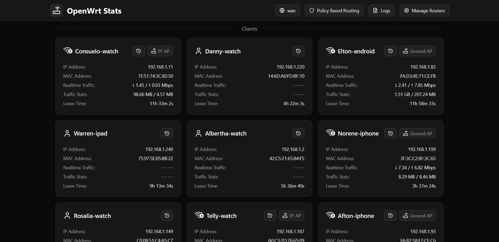
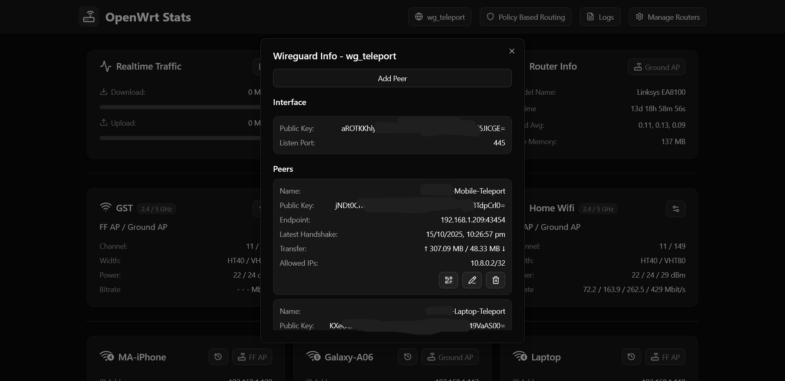
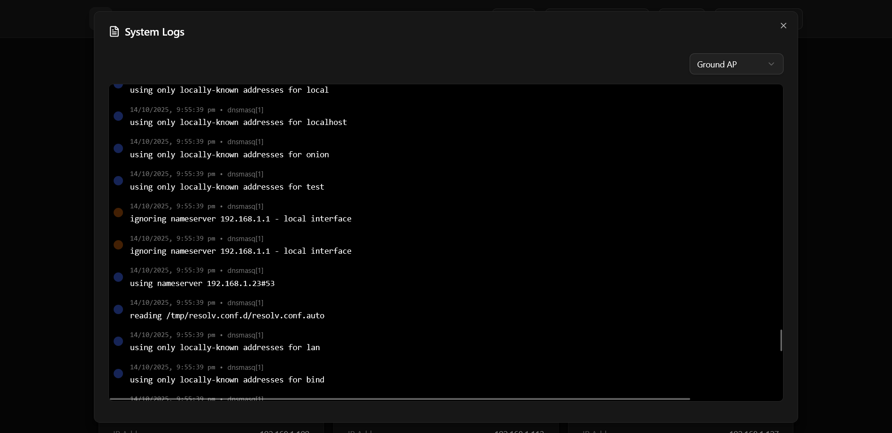

# Next.js OpenWrt Stats

A web dashboard for monitoring and managing all your OpenWrt APs from a single place.

## Features

### 🌐 Network Monitoring
- **Real-time Traffic Monitoring**: Live upload/download speeds with interactive charts
- **Network Interface Information**: Detailed status of all network interfaces
- **Router Information**: System stats including uptime, load average, and memory usage
- **DHCP Client Management**: View all connected devices with IP/MAC addresses and lease times

### 📡 WiFi Management
- **Access Point Control**: View and manage all WiFi APs across your network
- **WiFi Client Monitoring**: Real-time traffic stats for connected wireless clients
- **Signal Strength Monitoring**: View signal quality, noise levels, and connection details
- **Client Presence Tracking**: Monitor WiFi client connection/disconnection history with detailed event logs including:
  - **Event Detection**: Automatically detects when clients connect, disconnect, or move between APs/routers
  - **Historical Timeline**: View detailed connection history for each client
  - **Change Tracking**: Monitors when clients switch between WiFi networks, routers, or frequency bands

### 🔒 VPN & Security
- **WireGuard Management**: Full WireGuard VPN interface and peer management

### 🛣️ Advanced Routing
- **Policy Based Routing (PBR)**: Manage OpenWrt's PBR package through the web interface


## Screenshots

### Main Dashboard


### Router Management


### Clients


### WiFi Management


### Client Presence Tracking

| | |
|---|---|
|  |  |

### Policy Based Routing


### WireGuard VPN


### System Logs


## Quick Start (Docker Compose)

1. **Create Docker Compose configuration**
   ```yaml
   # docker-compose.yaml
   services:
     openwrtstats:
       image: lov432/openwrt-stats:v2
       container_name: openwrtstats
       volumes:
         - ./drizzle/db/:/app/drizzle/db/
       environment:
         - MAX_TRAFFIC=100 # Maximum traffic threshold for charts (in Mbps)
         - PBR_ENABLED=false # Enable Policy Based Routing features (requires OpenWrt pbr package)
         - PRESENCE_ENABLED=false # Enable WiFi client presence tracking and history
       ports:
         - 3000:3000
       restart: unless-stopped
   ```

3. **Start the application**
   ```bash
   docker-compose up -d
   ```

4. **Access the dashboard**
   Open your browser and navigate to `http://localhost:3000`

5. **Register your network devices**
    - On first launch, you'll be redirected to the registration page
    - Register your primary OpenWrt router first (main router that manages the network)
    - Add additional access points as needed - these are APs running OpenWrt, not separate networks

## Configuration

### OpenWrt RPC Configuration

**Required Setup Step**: On your primary OpenWrt router and all access points, create the following ACL file:

```bash
# Create the ACL file
vi /usr/share/rpcd/acl.d/openwrt-stats.json
```

Add this content to the file:

```json
{
        "openwrt-stats": {
                "description": "Grant UCI access to OpenwrtStats",
                "write": {
                        "ubus": {
                                "uci": [
                                        "set", "commit", "revert"
                                ],
                                "hostapd.*": ["get_clients"]
                        }
                }
        }
}
```

After creating the file, restart the rpcd service:

```bash
/etc/init.d/rpcd restart
```